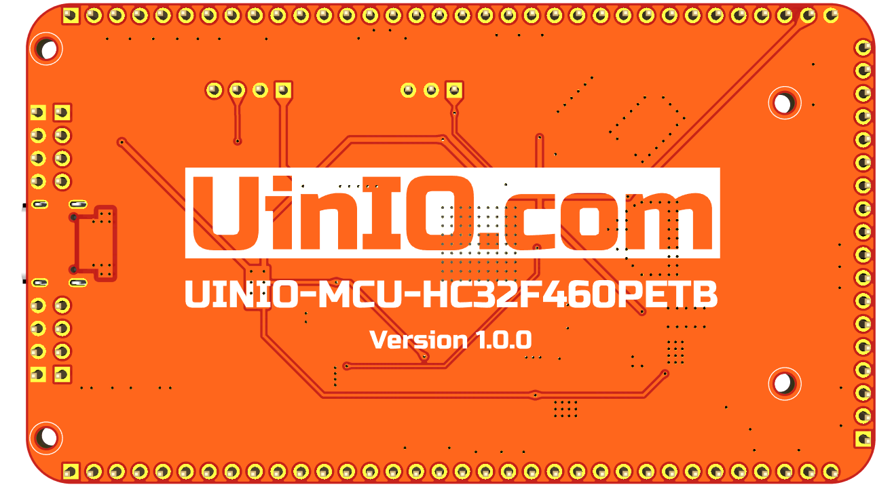

# UINIO-MCU-HC32F460PETB 核心板

[**UINIO-MCU-HC32F460PETB**](https://gitee.com/uinika/UINIO-MCU-HC32F460PETB) 

## 设计概要

## 参考技术文档

[UinIO.com 电子技术实验室](http://uinio.com/) 为 UINIO-MCU-HC32F460PETB 开源项目提供了如下一系列技术参考资料：

- [《BOM 交互式物料清单与 PCB 布线在线预览》](http://uinio.com/archives/BOM/UINIO-MCU-HC32F460PETB.html)
