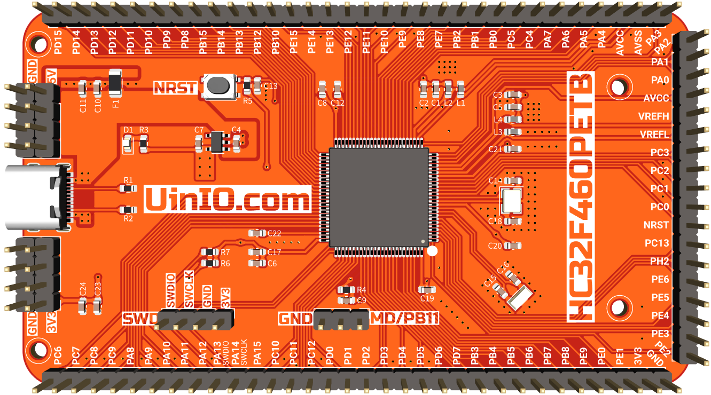

# UINIO-MCU-HC32F460PETB 核心板

[**UINIO-MCU-HC32F460PETB**](https://gitee.com/uinika/UINIO-MCU-HC32F460PETB) 是一款基于小华半导体 **HC32F460PETB-LQFP100** 型微控制器的核心板，该款微控制器的最大特点是支持 `1.8V ~ 3.6V` 的**宽电压范围**，和 `-40℃ ~ 105℃` 的**宽温度范围**。基于 **ARM Cortex-M4** 内核架构，最高工作频率可以达到 `200MHz`，内置有 **DSP** 数字信号处理器和 **FPU** 浮点运算单元。除此之外，还集成有 `512KB` 的 Flash 存储器，以及 `192KB` 的 SRAM 存储器。

## 设计概要

- 外部晶振电路，全部使用了打孔包地处理；
- 扩展了两路串联有自恢复保险丝的 `5V` 电源接口，整体采用覆铜处理，以提升接口的载流能力；
- 模拟电源引脚 `AVSS` 和 `AVCC` 都串联有对 `100Mhz` 高频杂散信号存在 `1KΩ` 阻抗的磁珠；
- 对调试下载接口 SWD 进行了前置处理，并且匹配了通信线序，可以方便快速的与 [**UINIO-DAPLink**](https://gitee.com/uinika/UINIO-DAPLink) 进行杜邦线连接；
- 引出了全部的 **83** 个 GPIO 端口，可以自由的使用 **8** 种常见的外设通信接口：

| 接口名称       | 数量  | 描述                                                                        |
| :------------- | :---- | :-------------------------------------------------------------------------- |
| **GPIO**       | 83 个 | `PAx`、`PBx`、`PCx`、`PDx`、`PEx`、`PHx` 一共六组。                         |
| **I2C**        | 3 组  | 支持 SMBus 协议。                                                           |
| **USART**      | 4 组  | 支持 ISO7816-3 协议。                                                       |
| **SPI**        | 4 组  | 支持 4 线式 SPI 模式和 3 线式时钟同步模式，支持全双工和只传送两种通信方式。 |
| **QSPI**       | 1 组  | 支持 `200Mbps` 高速访问的存储器控制模块。                                   |
| **I2S**        | 4 组  | 内置音频 PLL 支持音频级采样精度。                                           |
| **SDIO**       | 2 组  | 支持 SD/MMC/eMMC 格式。                                                     |
| **CAN**        | 1 组  | 支持 ISO11898-1 标准协议。                                                  |
| **USB 2.0 FS** | 1 组  | 内置 PHY，支持 Device/Host 模式。                                           |

## 参考技术文档

[UinIO.com 电子技术实验室](http://uinio.com/) 为 **UINIO-MCU-HC32F460PETB** 开源项目提供了如下一系列参考技术资料：

- [《UINIO-MCU-HC32F460PETB 核心板原理图》](http://uinio.com/my/works/UINIO-MCU-HC32F460PETB/UINIO-MCU-HC32F460PETB-Schematic.pdf)
- [《交互式 BOM 物料清单与 PCB 版图在线预览》](http://uinio.com/my/works/UINIO-MCU-HC32F460PETB/UINIO-MCU-HC32F460PETB-BOM.html)